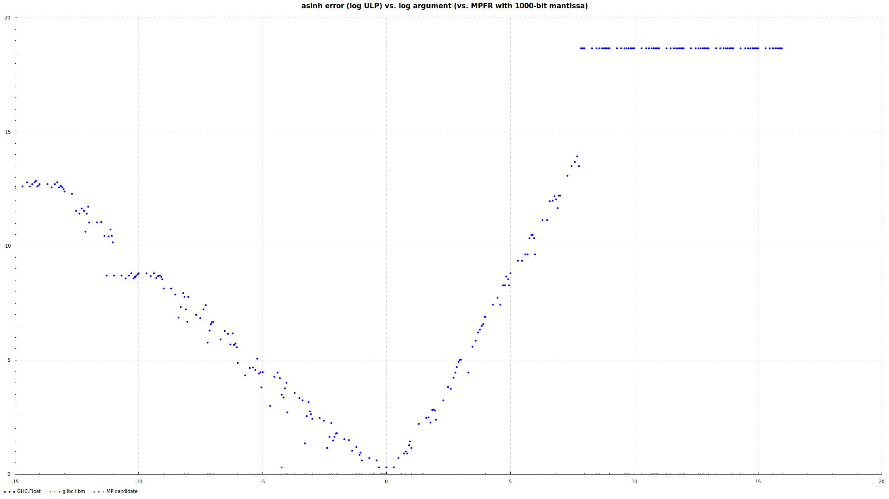
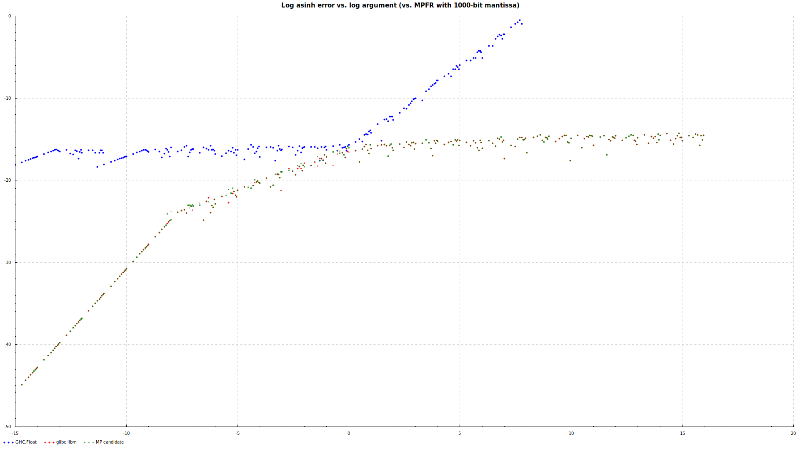
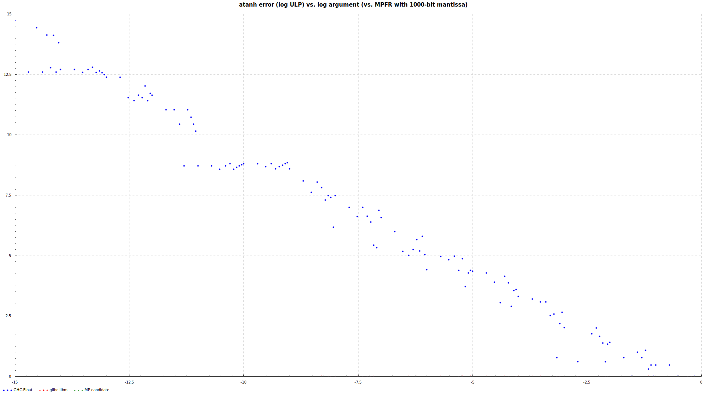
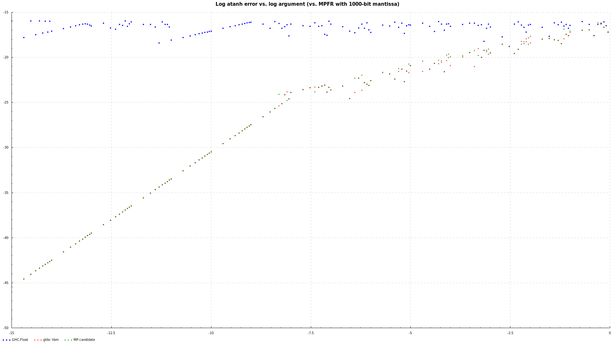
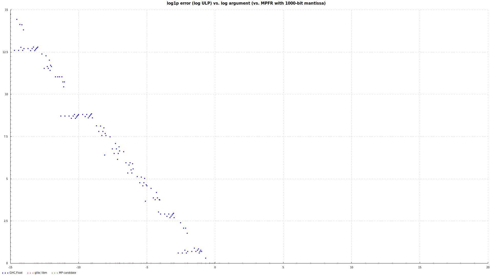
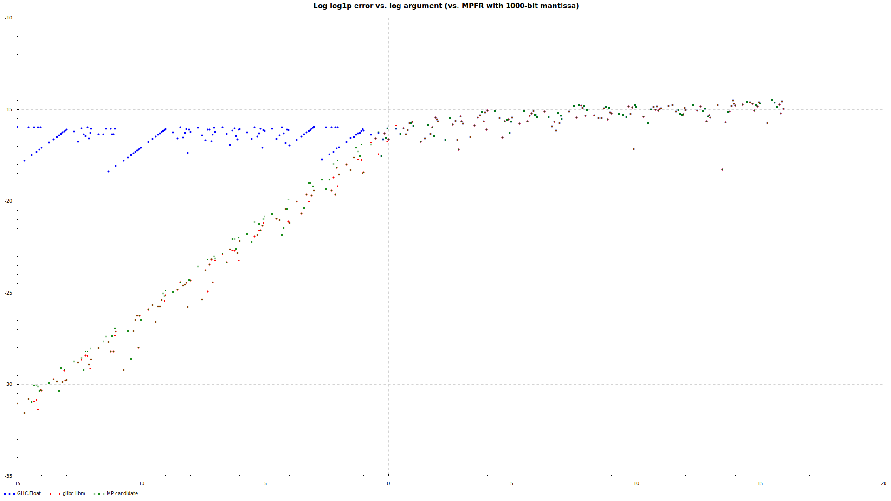

GHC's inverse hyperbolic trigonometric functions
================================================

Some of the mathematical functions defined in GHC's library exhibit
poor accuracy.  One good solution would be to always call the system
math library for these functions.  This package also defines pure
Haskell analogues of the more accurate C functions (for `Double`; the
same thing is easy to do for `Float`) that could be used instead.  The
rest of this README explains the problem.

Original definitions
--------------------

`asinh` is defined in [GHC.Float](https://hackage.haskell.org/package/base/docs/src/GHC.Float.html#line-478) as

    asinh x = log (x + sqrt (1.0+x*x))

which, unsurprisingly, has problems for large negative values of `x`.
Similarly, `atanh` is defined as

    atanh x = 0.5 * log ((1.0+x) / (1.0-x))

which exhibits similar problems.  (The definition of `acosh` seems to
behave just fine.)

Proposed improvements
---------------------

This package contains versions of these functions which are much more
accurate, implemented via the same logic as GNU libm.  See
[Hyperbolic.hs](https://github.com/peddie/ghc-inverse-hyperbolic/blob/master/src/Hyperbolic.hs)
for their definitions.

### `log1p`

An accurate version of the standard `log1p` function was needed to
implement `asinh` and `atanh`.  This function is not currently
provided by GHC (see [this mailing list
thread](https://mail.haskell.org/pipermail/libraries/2014-April/022667.html)),
but since it was needed to define accurate versions of `asinh` and
`atanh`, a comparison to the naive definition `\x -> log (1 + x)` is
included just out of interest.

Error measurements
------------------

Each implementation (GHC, GNU libm, candidate replacement) was
compared at a handful of grid points to a "truth" value as calculated
by GNU MPFR to high precision.  This package contains an executable
called `generateInverseHyperbolicErrorPlots` (yikes) which generates,
for each function, a plot of log error magnitude vs. log of the
argument along with a plot of the log of error in ULP (units in the
last place, or number of discrete `Double` values away from the "true"
result) vs. log of the argument.

To build this package and measure the error the same way I did to
produce the plots below, you will need the `mpfr` library and headers
installed on your system.  You'll also need the `cairo` graphic
library with development headers.  On my system I did this with `sudo
apt-get install libmpfr-dev libcairo2-dev`.

Plots
-----

### `asinh`

Here is error in ULPs vs. argument for `asinh`:

Note that you mostly only see points corresponding to GHC's version,
because the worst-case error for either `libm` or the proposed
replacement function ("MP candidate") is only a few bits independent
of the argument.  The current version is all over the place; the flat
line at the upper right is where it returns `-Infinity` for large
negative arguments.

Here is error magnitude vs. argument for `asinh`:

The proposed replacement mostly matches `libm`'s behavior and is never
worse than the current version.

### `atanh`

Error in ULPs for `atanh`:

The current version of this function is clearly a bit better behaved
than `asinh` (at least it doesn't start returning `Infinity` values),
but it can still lose almost all the precision available for small
arguments.

Here is error magnitude:

The current version's errors are of constant size independent of the
argument, which means that as the argument gets small, they become
relatively very large.  The proposed version and `libm` have the same
behavior, wherein the error decreases as the argument decreases.
Neither is ever worse than the current version in GHC.

### `log1p`

Error in ULPs for `log1p`:

The behavior of the naive calculation for `log (1 + x)` is
well-understood to be poor as `x` gets small.

Here's error magnitude, for completeness:

This function exhibits the same behavior as `atanh`, where the
absolute error magnitude gets relatively larger as the argument
decreases.